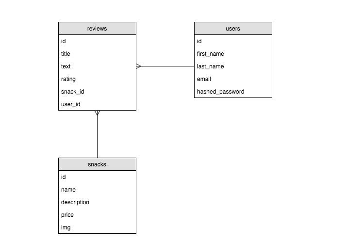

Working in groups of 3-5 and following the user stories below, your team will attempt to create the fullstack application, 'Galvanize Snacks'.

This repository is solely the backend of the project. You will need to build the frontend as well!

## User Stories

This repo includes some files to get you started, but it's up to you to finish these user stories:

- **User can view all snacks**
  - When the user visits the homepage they see a list of all snacks

- **User can view details of an individual snack**
  - When the user clicks on a snack, display full information about that snack
  - Display list of reviews for snack
  - Display average rating of snack

- **User can signup a new account**
  - Display a form for the user to enter a name, email & password.
  - This should create a user in your database

- **User can post a review of a snack**
  - Display a form for the user to post a new review for a specific snack
  - If any information is missing when the user submits, surface an error
  - If everything is correct, bring them back to the snack's page to see their review

- **User can edit their own review of a snack**
  - Display a form for the user to edit a review for a specific snack
  - Pre-fill form with current review data
  - If any information is missing when the user submits, surface an error

- **User can delete their own review of a snack**
  - Provide option to delete a users own review for a specific snack
  - User **cannot** delete other users reviews

## Stretch
If everything above is completed then try to get actual Auth and Auth up and running. Creating the user table gave you the foundation to implement security at a later time.

- **User can login with an existing account**
  - Display a form for the user to enter an email & password.
  - Clearly indicate login success or failure to the user

- **Unauthenticated users do not see forms and fields they cannot use**
  - Hide the review form if a user is not logged-in
  - Hide all buttons the user is not authorized to use

- **Admins can view a special admin dashboard for them**
  - Add `admin` column to users table
  - Update seeds to make a new user an admin
  - When a user logs in and they are an admin, bring them to this page
  - Users who are not admins are redirected to the home page

- **Admins can create, update, and remove snacks**
  - Admin can add new snacks through this admin page
  - Admin can remove existing snacks through this admin page
  - Admin can edit existing snacks through this admin page

- **Admins can remove users**
  - Admin can remove users through the admin page
  - When a user is removed, all their reviews are deleted
  - Admins **cannot** remove other admins (or themselves)

## Entity Relationship Diagram

**NOTE:** The JSON data for the `snacks` table is included. You will need to implement the `snack`, `users`, and `reviews` tables yourself following this relationship diagram.

## Routes

| Request Method | Request URL | Request Body | Response Status | Response Body                                                  |
|----------------|-------------|--------------|-----------------|----------------------------------------------------------------|
| `POST`         | `/api/users`           | `{ "first_name": "Linus", "last_name": "Torvalds", "email": "linus.torvalds@hotmail.com", "password": "ilovelinux" }` | `200`           | `{ id: 2, "first_name": "Linus", "last_name": "Torvalds", ... } |

## Helpful Hints and Cautionary Advice

* Spend time planning

* Do some pair-programming

* Develop your code using a team git workflow

* Use an agile process to complete the project.

* Don't silo your work, ie don't let ones person build all of the back-end, and then another person build all of the front-end.

* Deploy early and often

* Take your time and have fun with it. This is your time to experiment with teams and workflow before actually getting into the group projects next week.

